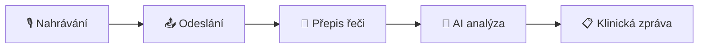

# ScriptorMed Dokumentace

Vítejte v dokumentaci **ScriptorMed** — platformy pro AI-asistovanou klinickou dokumentaci.

ScriptorMed automatizuje tvorbu lékařských zpráv z audiozáznamů konzultací. Nahrajte vyšetření, a během minuty máte strukturovanou klinickou zprávu připravenou k vložení do vašeho nemocničního informačního systému.

---

## Jak začít

-   :material-monitor:{ .lg .middle } **Desktop aplikace**

    ---

    Nahrávání konzultací a generování klinických zpráv.

    [:octicons-arrow-right-24: Instalace](desktop/instalace.md)

-   :material-web:{ .lg .middle } **Portál**

    ---

    Správa předplatného, licenčních klíčů a fakturace.

    [:octicons-arrow-right-24: Registrace](portal/registrace.md)

-   :material-help-circle:{ .lg .middle } **Řešení problémů**

    ---

    Odpovědi na časté otázky a řešení technických problémů.

    [:octicons-arrow-right-24: FAQ](faq.md)

-   :material-email:{ .lg .middle } **Kontakt**

    ---

    Technická podpora a kontaktní údaje.

    [:octicons-arrow-right-24: Kontakt](kontakt.md)

---

## Jak ScriptorMed funguje

| Krok | Co se děje | Doba |
|------|-----------|------|
| **Nahrávání** | Aplikace zachytí zvuk z mikrofonu | Délka konzultace |
| **Odeslání** | Nahrávka se odešle na server | 2–5 sekund |
| **Přepis** | Rozpoznávání řeči převede zvuk na text | 10–30 sekund |
| **AI analýza** | Umělá inteligence vytvoří strukturovanou zprávu | 15–45 sekund |
| **Výsledek** | Hotová zpráva se zobrazí v aplikaci | Okamžitě |

!!! tip "Celková doba zpracování"
    Od ukončení nahrávání po hotovou zprávu typicky **30–90 sekund** v závislosti na délce konzultace.

---

## Pro koho je ScriptorMed určen

ScriptorMed je navržen pro **lékaře v dermatologických ambulancích**. Výstupní zpráva dodržuje standardní český dermatologický formát včetně kompletní anamnézy, objektivního nálezu, závěru a doporučení.

!!! info "Další odbornosti"
    Systém je připraven na rozšíření do dalších lékařských odborností. Pokud máte zájem o podporu pro váš obor, [kontaktujte nás](kontakt.md).
